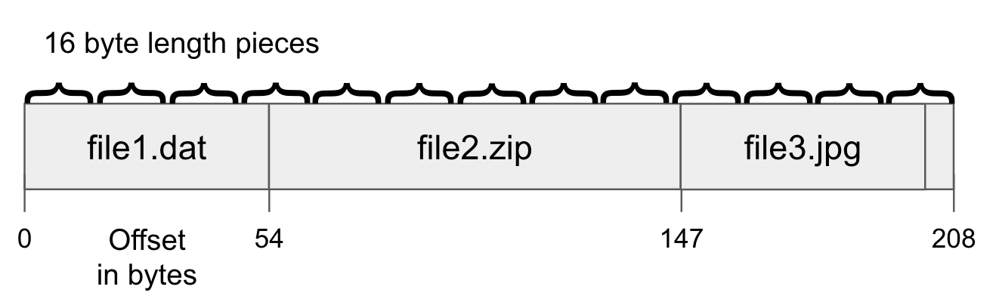
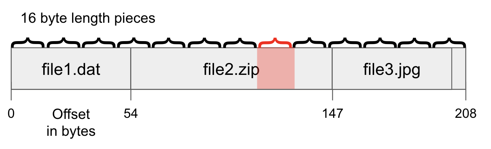

# BitTorrent

BitTorrent is a peer-to-peer (P2P) file-sharing protocol that allows users to distribute large files efficiently. It works by breaking a file into small pieces, which are then distributed among a network of users, or "peers." Each peer then shares these pieces with other peers, allowing the file to be downloaded quickly from multiple sources at once.

The protocol uses a central tracker, which keeps track of the location of all the pieces of a file and the peers that are currently sharing them. When a user wants to download a file, they connect to a tracker (such as Academic Torrents), which provides them with a list of peers that have the file. The user then connects to these peers and begins downloading the pieces of the file.

One of the key features of BitTorrent is that it is a "swarm-based" protocol, meaning that as more users begin downloading a file, the more available sources there are for other users to download from. This helps to ensure that the download process remains fast and reliable, even as the number of users increases.

BitTorrent has the advantage of being decentralized, meaning that there is no central server or authority controlling the distribution of files. This means that there are no single points of failure that could cause the network to fail.

There are many open source BitTorrent clients available. These clients handle the details of connecting to trackers, downloading pieces of files, and managing the upload and download of data. This diversity and accessibility of clients mitigates the risk of a single entity gaining monopolistic control and potentially imposing charges or restrictions on usage.

## Pieces

In BitTorrent, files are broken down into small pieces. Historcially the sizes are between `64` and `256` KiB in size but for Academic Torrents they can go up to `8192` or `16384` KiB to better handle large files. Each of these pieces is then assigned a (hopefully) unique cryptographic SHA1 hash, which is used to ensure the integrity of the data by the clients. This means that when a user downloads a piece of a file, they can compare the hash of the piece they received to the one that was originally computed by the file creator, to ensure that the data has not been tampered with or corrupted.

When a user first creates a new file to share using BitTorrent, they first compute the hash of each piece of the file and create a "metadata" file, also known as a ".torrent" file. This file contains the list of hashes for all the pieces of the file, as well as information about the file itself, such as filenames, sizes, and the address of the tracker.

The use of cryptographic hashes in BitTorrent helps to ensure the integrity of the data being shared on the network, and helps to prevent the spread of corrupted or tampered files. This is particularly important for large files, where a single corrupted piece can render the entire file unusable. When receiving a piece from a peer the hash of the piece is computed. If the hash matches what is contained in the metadata, the user knows that the piece is an authentic and uncorrupted version of the file. However, if the hash does not match, the user knows that the piece is corrupt and needs to be redownloaded.

When a corrupt piece is detected, the BitTorrent client will typically mark the piece as "bad" and request a new copy from one of the other peers that the client is connected to. A piece may become corrupted due to a problem with the storage media, a network error, or even an intentional attack. Using hashing in this fashion allows the identification of a small corrupt piece in a large file so the entire file won't need to be restored. 

## Trackers

In BitTorrent, a "tracker" is a server that keeps track of the location of all the pieces of a file and the peers that are currently sharing them. When a user wants to download a file, they connect to the tracker, which provides them with a list of peers that have the file. The user then connects to these peers and begins downloading the pieces of the file. The requesting user is added to the tracker and will be shared on subsequent requests.

The tracker plays a crucial role in the BitTorrent network, as it is responsible for coordinating the distribution of files among the peers. It does this by maintaining a list of all the peers that are currently sharing a file and what percent of the file they have. Peers connect with each other to determine what pieces they have.

In recent years, some clients have adopted a technique known as "trackerless" or "DHT" (Distributed Hash Table) which eliminates the need for a central tracker and relies on a distributed system of nodes to keep track of the peers and files, this makes the network more resilient.

