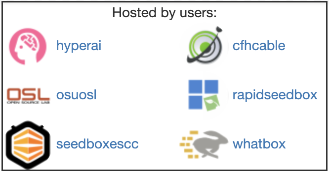

# Mirroring

One benefit of BitTorrent is the ability for the data to be dynamically mirrored. You can become part of the Academic Torrents hosting infrastructure by "seeding" the data that you have downloaded. Your BitTorrent client will automatically register with our tracker (sending your IP address and port to connect to) when you open the BitTorrent file in it and the data you have downloaded will be available to be sent to others. 

We recommend using Transmission Daemon (Linux package `transmission-daemon`) because it runs as a background service and will automatically start with the system and is very stable. 


## Transmission Daemon

To set up Transmission Daemon on Debian/Ubuntu install the package:

```
sudo apt install transmission-daemon
```

Once it is installed a web server to control the client is available at `http://localhost:9091/`. Be sure to set a username and password in the configuration file. 


In `/etc/transmission-daemon/settings.json` set:
```
"rpc-authentication-required": true,
"rpc-password": "something",
"rpc-username": "something",
```


Note you need to stop transmission before editing the settings file or your changes will be erased.
```
service transmission-daemon stop
## edit /etc/transmission-daemon/settings.json
service transmission-daemon start
```


## "Hosted by" attribution



When hosting a torrent you can have this be associated with your account in order to show your name and image. On the details page of each torrent a box shows users which are currently hosting data.

In order for our system to associate your account with a torrent is a passkey that is embedded in the torrent file. This is inserted when you download a torrent while logged in. Some BitTorrent clients let you specify cookies used when requesting .torrent files. You can use your API key as the cookie to associate the torrent with your account.

## Collections

We would like to avoid the blind mirroring of all data. We provide RSS feeds for subsets of all the torrents grouped into collections.

Per collection RSS feeds allow you to mirror only collections you care about. Each collection has it's own unique RSS feed. You can add the RSS feeds found on this page: [http://academictorrents.com/collections.php](http://academictorrents.com/collections.php) You can mirror these RSS feeds automatically with a BitTorrent client such as ruTorrent, uTorrent, or qBitTorrent. 


## Smartnodes

We are slowly making progress on tools which automatically download and manage torrents. The current development repo is here: [https://github.com/academictorrents/smartnode-transmission](https://github.com/academictorrents/smartnode-transmission )

The goals of this project are as follows:

- Smart BitTorrent client (Not just syncing an RSS feed)
- Mirrors based on resources donated
  - Limit by space
  - Limit by RSS feed
  - Limit by bandwidth
- Dynamically select in-need data
  - Low peers
  - Not geographically distributed
  - Slow downloads
- Completely client side 


