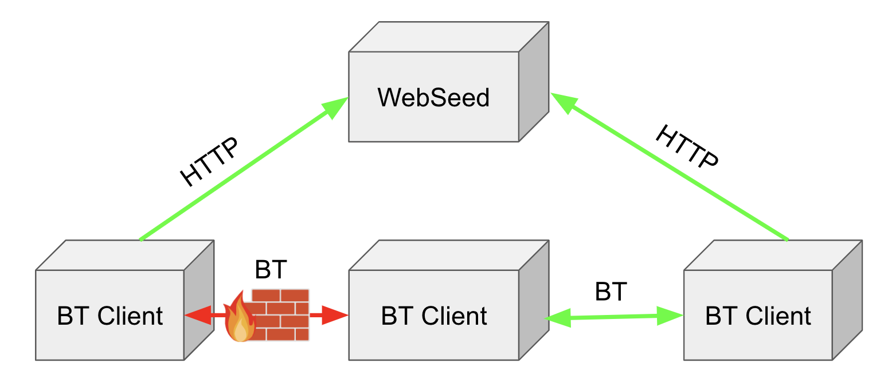

# Uploading

## Overview

There are multiple ways to share your data on our site. If you're unsure about the process, please reach out to us for assistance. You can use the upload form available at [https://academictorrents.com/upload.php](https://academictorrents.com/upload.php).

It's important to note that we don't directly host your data. However, we manage a network of donated servers. When you upload a torrent file to our site, hosting nodes (seeds) register with the tracker to provide download locations for the data. Alternatively, you can use a Backup URL instead of hosting the file using BitTorrent. This allows you to take advantage of our server platform, where the data will be mirrored.

## Tutorials

Academic Torrents - How to upload for researchers

<iframe src="https://www.youtube.com/embed/PVsTwlYxGPo" style="max-width:100%"  width="640" height="480" frameborder=0 allowfullscreen></iframe>
  

## Piece sizes

The piece size of a torrent is the size of the smallest chunk of the file that is sent between torrent clients. Valid sizes are powers of 2. If the total number of pieces is large then it will a lot of small transactions will have to happen when downloading and may require a lot of CPU because each piece needs to have its hash computed in order to verify it is correct. If the piece size is too large then the transmission may fail in the middle and require the entire piece to be sent again. 

We recommend relatively large piece sizes (`8192` or `16384` KiB) because academic connections are typically good enough to not produce errors at this size and a very large file with a small piece size could yield so many pieces that it is a computational burden to download it.

## Backup URLs

When a user downloads a torrent, in the event that BitTorrent is blocked or if there are no seed nodes, a list of Backup URLs (also called WedSeeds) can be maintained dynamically. These URLs can be updated on the website and then are injected into the torrent file when it is downloaded. These will bypass firewalls because it looks like regular web browsing. The experience is the same as downloading the torrent normally when using a BitTorrent client which supports (such as Transmission).

A "Backup URL" which is an HTTP URL linking to the data file (or if it is a directory then the URL minus the folder name). 

In the case of a folder it is important to use the correct path. If the files are in a folder named `sourcedata` and the files are on a server under this path `http://server/folder/sourcedata/` then the Backup URL would be `http://server/folder/`

Here is an example torrent with a backup url: http://academictorrents.com/details/cf445f6073540af0803ee345f46294f088e7bba5

The backup url is "https://files.inria.fr/" because the folder that contains the files is aerialimagelabeling and they can be accessed like this: https://files.inria.fr/aerialimagelabeling/aerialimagelabeling.7z.001

Note: this is only the case for torrents which are created from folders. If the torrent is just a single file then you specify the direct path.

### RANGE queries

BitTorrent clients will use HTTP RANGE queries to select the pieces they want to download. If this is not available then the client will try to download the entire file at once which can fail if the file is too large or the connection is unstable.

Most webservers will support this (such as Apache and NGNIX) but less featured webservers such as the python http.server do not have this feature.

### Hosting providers that work as Backup URLs

Almost all paid providers work work perfectly as Backup URLs while almost all free hosting provders (Google Drive, Dropbox) do not work as Backup URLs. Here is a list of free providers which will provide HTTP URLs that can be used as Backup URLs:

- [https://archive.org](https://archive.org)
- [https://zenodo.org/](https://zenodo.org/) (only works for single files torrents)

